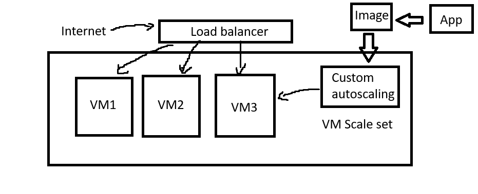

How to deploy an app with high availability and scalability:
- Using a VMSS
- Spreading VM's accross 3 zones.
- Minimum of 2 VMs.


# Auto Scaling

## Why use autoscaling:

Worst to better: When CPU load is too high
1. Fall over (worst option)
2. dashbord
3. alert- e.g. alarms going off at 3.5% cpu usage.
   - for testing purposes. Generally it's 40%.
4. autoscaling (best option)

### Types of scaling:
1. Horizontal scaling (in or out) (more instances).
2. Vertical scaling (up or down) (more CPU, RAM etc).

### Azure Virtual machine scale sets (VMSS)

- Same as aws autoscaling group
- **High availability and scalability** and making application reliable!
- Custom autoscale:
  - When CPU exceeds 75%
  - Start with 2 VMs:
    - Disaster recovery plan, redundancy, high availablity.
  - Minimum 2
  - Default 2 
  - Maximum 3  
  - Put the VM's into different zones to ensure high availability and redundancy:
    - Zone 1, 2, 3.
- The VMSS will create the VM's from the images given to it.
- Traffic enters through internet- load balancer will recieve the traffic and balance it accross VM's.


- If VM image is created with userdata, and you use that image for the VMSS, when you stop vm, and restart it, status will show as unhealthy because the userdata only works initially and app won't be accessible after restart.

- Reimage= User data runs again and VM is returned to initial state- everything else is deleted.


## Creating a VMSS:
- Name: tech501-zainab-sparta-app-vmss
- AZ: Zone 1, 2, 3
- Orchestration mode: Uniform
- Security type: Standard
- Scaling mode: Autoscaling
    - Configure- click the edit button
    - Min=2, Max=3, Default=2
    - Scale out= CPU threshold 75%
    - Save
- Image: See all images- my images- select your own app image.
- SSH key- select existing key on azure- select your own key.
- OS disk type- Standard SSD
- PublicIp: Disabled (don't need one because we will access VM through load balancer).
- Frontend port range start: 50000 (ssh to port 50000 to reach first vm, incrementing by one for the next etc)
- Backend port: 22
- Load Balancer: Create a new load balancer
    - Name: tech501-zainab-app-lb
    - Need to connect to our VM's through port 50000 upwards e.g. 1st VM SSH will be through port 50000, - 2nd through 50001 etc.
- Enable health monitoring.
- Enable automatic repairs.
- Enable User data and paste in the script:
```
#!/bin/bash
cd /repo/app
pm2 start app.js

```



- Enter public IP of the VMSS into the browser- should show app page.
  - Might take a few mins.
- **When you restart vm** (stop and start vm), need to reimage atleast 1 vm for the app to work. 
  - This is because the image user data for the vm only runs the first time and the app won't start up everytime after that.
  - Reimaging means the userdata runs again from scratch and the vm is replaced.

Health status is only healthy or unhealthy if the vm is running. Blank if not running.

### SSH into the VM:

- No public Ip and can't go through private Ip (not in the same vnet) so have to go in through the load balancer.
- So use load balancer IP.
- `ssh -i ~/.ssh/tech501-zainab-az-key -p 50000 adminuser@85.210.45.236`
  - `-p 50000` specifies the port that we use to SSH into the vm- specified in the vmss settings.

### Deleting the VMSS:
- Go to VMSS- Delete option at the top.
- Have to delete load balancer separately. 
  - Go to load balancers.
  - Delete.